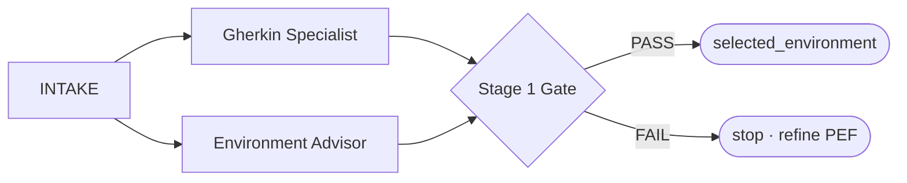
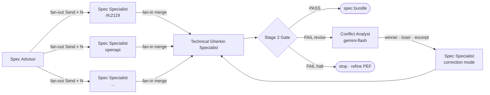

# Norma — Architecture

Ground-level implementation reference: graph topology, state, nodes, execution, and tests as implemented today. For design rationale see [vision.md](vision.md). For iteration rhythm see [PROCESS.md](PROCESS.md). For planned changes see per-REQ architecture delta docs (`docs/architecture_reqXXX_changes.md`), merged here when the REQ closes.

---

## Workflow

Two pipelines run sequentially. Pipeline 2 starts only after Pipeline 1 completes and `selected_environment` is written to state.

All LLM calls go through LiteLLM (`http://localhost:4000`). Every node emits a Langfuse span (`http://localhost:3000`). No node calls a model provider directly.

### Pipeline 1 — Business Layer



### Pipeline 2 — Technical Layer

Starts with `selected_environment` + `gherkin_business` from Pipeline 1.



**Conflict correction loop:** on Stage 2 Gate failure, a Conflict Analyst node identifies the root upstream spec conflict and extracts an authoritative excerpt from the winning artefact. The losing specialist re-runs in correction mode (lean prompt: fix only the conflicting definition). Max 2 revision cycles (`MAX_REVISIONS`).

**Layer hierarchy** — determines winner/loser via `depends_on` graph:

| Layer | Standards | Role |
|---|---|---|
| 1 — Constraints | RFC 2119, ADR | Authoritative — never corrected |
| 2 — Architecture | C4 / Structurizr | Authoritative — never corrected |
| 3 — Interface | OpenAPI, AsyncAPI | Authoritative over Layer 4 |
| 4 — Validation | JSON Schema | Corrected to conform to Layer 3 |
| 5 — Tests | Technical Gherkin | Corrected to conform to all layers |

---

## State — `NormaState`

`src/norma/graph/state.py` — TypedDict passed through the graph. Each node receives the full state and returns a partial update (only the keys it wrote).

| Key | Type | Written by | Read by |
|---|---|---|---|
| `raw_requirement` | `str` | caller | INTAKE |
| `normalised_requirement` | `str` | INTAKE | GHERKIN, SPEC ADVISOR, specialists |
| `actors` | `list[str]` | INTAKE | gates |
| `external_deps` | `list[str]` | INTAKE | SPEC ADVISOR |
| `gherkin_business` | `str` | GHERKIN SPECIALIST | STAGE 1 GATE |
| `gherkin_content` | `str` | GHERKIN SPECIALIST | STAGE 1 GATE |
| `environment_options` | `list[EnvironmentOption]` | ENVIRONMENT ADVISOR | STAGE 1 GATE |
| `selected_environment` | `EnvironmentOption` | STAGE 1 GATE | downstream |
| `stage1_passed` | `bool` | STAGE 1 GATE | graph router |
| `stage1_feedback` | `str` | STAGE 1 GATE | graph router |
| `spec_advice` | `list[SpecRecommendation]` | SPEC ADVISOR | graph (fan-out via Send) |
| `current_recommendation` | `SpecRecommendation` | graph (injected per Send) | SPEC SPECIALIST |
| `spec_artefacts` | `dict[str, str]` | SPEC SPECIALIST(s) (merged) | STAGE 2 GATE, CONFLICT ANALYST |
| `gate_winner_key` | `str` | CONFLICT ANALYST | SPEC SPECIALIST (correction) |
| `gate_loser_key` | `str` | CONFLICT ANALYST | SPEC SPECIALIST (correction) |
| `gate_authoritative_excerpt` | `str` | CONFLICT ANALYST | SPEC SPECIALIST (correction) |

---

## Nodes

### INTAKE
**File:** `src/norma/graph/intake.py` · **PEF:** COSTAR  
**In:** `raw_requirement` · **Out:** `normalised_requirement`, `actors`, `external_deps`

Normalises the raw requirement into structured form. Downstream nodes read `normalised_requirement`, not `raw_requirement`.

---

### GHERKIN SPECIALIST
**File:** `src/norma/graph/gherkin_specialist.py` · **PEF:** CRISPE  
**In:** `normalised_requirement` · **Out:** `gherkin_business`, `gherkin_content`

Runs in parallel with SPEC ADVISOR immediately after INTAKE. Permanent — every requirement gets a `.feature` file.

---

### SPEC ADVISOR
**File:** `src/norma/graph/spec_advisor.py` · **PEF:** CRISPE  
**In:** `normalised_requirement`, `selected_environment` · **Out:** `spec_advice`

Recommends which spec languages are needed and why. Drives the dynamic fan-out: one `Send` per `SpecRecommendation`, each injecting `current_recommendation` into a SPEC SPECIALIST invocation.

Each `SpecRecommendation` carries: `language`, `artefact_key`, `rationale`, `depends_on`, `requirement_segments`, and the CRISPE fields `role` / `insight` / `statement` injected into the specialist.

**Input note:** does not receive Business Gherkin — Spec Advisor makes an architectural decision (which spec languages), not a behavioural one. The normalised requirement + environment choice carries all structural signal needed.

**Output discipline:** hard word-count limits per field prevent JSON truncation at the `max_tokens` ceiling (`rationale` ≤15 words, `requirement_segments` ≤20 words, `role` ≤15 words, `insight` ≤3 bullets × ≤8 words, `statement` ≤3 lines). A one-shot JSON example in `prompts/spec_advisor.yaml` anchors the output schema.

---

### SPEC SPECIALIST
**File:** `src/norma/graph/spec_specialist.py` · **PEF:** CRISPE (fields from `current_recommendation`)  
**In:** `current_recommendation` · **Out:** `spec_artefacts[artefact_key]`

Dispatched N times in parallel via `Send`. Results merged into `spec_artefacts` by the graph reducer. Fixed CRISPE fields (`capacity`, `personality`, `experiment`) are stable across all invocations; `role`, `insight`, `statement` are injected per recommendation.

**Statement field — two-phase self-anchoring:** the `statement` field is prefixed at runtime with a two-phase instruction: Phase 1 — generate a 4–6 line canonical example of the target spec format (`## EXAMPLE`); Phase 2 — use that example as scaffold to write the full artefact (`## ARTEFACT`). The node extracts only the `## ARTEFACT` section from the response (falls back to full response if label absent). This prevents format regression without requiring a static example registry per spec type.

---

### ENVIRONMENT ADVISOR
**File:** `src/norma/graph/environment_advisor.py` · **PEF:** CRISPE  
**In:** `normalised_requirement`, `external_deps` · **Out:** `environment_options`

Recommends technology environments ranked by suitability. Stage 1 Gate selects `rank=1`.

---

### STAGE 1 GATE
**File:** `src/norma/graph/stage1_gate.py` · **PEF:** CAI  
**In:** `normalised_requirement`, `gherkin_business`, `gherkin_content`, `environment_options`  
**Out:** `stage1_passed`, `stage1_feedback`, `selected_environment`

Validates Gherkin artefacts and selects the environment. FAIL stops the pipeline. Verdict is parsed from the LLM response string — not inferred from content.

---

### CONFLICT ANALYST
**File:** `src/norma/graph/conflict_analyst.py` · **PEF:** CRISPE  
**Model:** `cloud/gemini-flash` (fixed — cost-optimised diagnostic node)  
**In:** `gate_feedback`, `spec_artefacts`, `spec_advice` · **Out:** `gate_winner_key`, `gate_loser_key`, `gate_authoritative_excerpt`

Invoked only on Stage 2 Gate failure. Identifies the root upstream spec conflict (not the Gherkin symptom), determines winner/loser via the `depends_on` layer hierarchy, and extracts the minimal authoritative excerpt from the winner. The losing specialist then re-runs in correction mode with this excerpt as its only constraint.

---

### STAGE 2 GATE
**File:** `src/norma/graph/stage2_gate.py` · **PEF:** CAI  
**In:** `spec_artefacts`, `normalised_requirement` · **Out:** gate verdict (PASS/FAIL)

Validates the full spec bundle: structural conformance per artefact type and cross-artefact consistency. Runs after all specialists complete.

---

### TECHNICAL GHERKIN SPECIALIST
**File:** `src/norma/graph/technical_gherkin_specialist.py` · **PEF:** CRISPE  
**In:** `normalised_requirement`, `spec_artefacts` · **Out:** `@technical` `.feature` artefact

Generates technical Gherkin scenarios derived from the spec artefacts. Runs after specialists complete.

---

## Execution paths

### Full pipeline
```bash
uv run python scripts/run_pipeline2.py
```
Runs the entire graph end-to-end. Output saved under `output/specs/`.

### Single node
```bash
uv run python scripts/run_node.py <node> tests/fixtures/<snapshot>.json [--save]
```
Loads a state snapshot, runs one node, prints the state diff. `--save` writes output as `<snapshot>.<node>.out.json`.

Available nodes: `intake`, `gherkin_specialist`, `environment_advisor`, `stage1_gate`, `spec_advisor`, `spec_specialist`, `technical_gherkin_specialist`, `stage2_gate`

State snapshots in `tests/fixtures/`:

| File | State at |
|---|---|
| `state_empty.json` | Before INTAKE |
| `state_post_intake.json` | After INTAKE |
| `state_post_stage1.json` | After STAGE 1 GATE |
| `state_post_spec_advisor.json` | After SPEC ADVISOR |
| `state_pre_spec_specialist_rfc2119.json` | SPEC ADVISOR done, `current_recommendation` = rfc2119 |
| `state_post_specialists.json` | After all specialists |
| `state_post_tech_gherkin.json` | After TECHNICAL GHERKIN SPECIALIST |

Snapshots are source-controlled. When a REQ changes `NormaState` or a node's output, update the affected fixtures in the same commit.

### Override model per run
```bash
NORMA_DEFAULT_MODEL=cloud/gemini-flash uv run python scripts/run_node.py spec_specialist tests/fixtures/state_pre_spec_specialist_rfc2119.json
```

---

## Test suite

```bash
uv run pytest                          # all tests (includes @pytest.mark.llm — requires live services)
uv run pytest -m 'not llm'            # fast, no services needed
uv run pytest tests/test_foo.py::bar  # single test
```

**57 tests total.** Split:

| File | What it tests | LLM tests |
|---|---|---|
| `test_node_intake.py` | `_parse_output` parsing logic; node returns all keys | 2 |
| `test_node_gherkin_specialist.py` | Output shape, fence stripping, fixture-based smoke | 3 |
| `test_node_gates.py` | Structural assertions (Stage 1 + Stage 2); gate PASS/FAIL parsing | 6 |
| `test_spec_advisor.py` | `_parse_advice` JSON parsing, field validation, key sanitisation; dispatch fan-out logic | 0 |
| `test_spec_specialist.py` | `_build_crispe` field injection; artefact extraction; fence stripping; fallback | 0 |
| `test_nfr_specialist.py` | NFR specialist output shape, fence stripping (legacy node) | 0 |

Non-LLM tests cover parsing, structural validators, and dispatch routing — all deterministic. `@pytest.mark.llm` tests hit live services and validate end-to-end node behaviour, not prompt content.

### Adding tests for a new node
1. Add a fixture to `tests/fixtures/` covering the node's required inputs.
2. Write non-LLM tests for any parsing or structural logic.
3. Write one `@pytest.mark.llm` smoke test: run node against fixture, assert output keys are present and non-empty.
4. If the node produces a structured artefact, add a structural assertion test matching the gate check for that artefact type.

---

## Cross-cutting concepts

**Reverse prompting** — when a node fails a structural assertion and PEF edits don't close the gap, the failing model is asked to generate a system prompt that would produce the desired output. The suggested delta is applied as a surgical CRISPE field edit. Outcome is either pass (done) or a characterised quirk. Technique documented in [PEF.md](PEF.md).

**Model quirk register** — the store of characterised quirks discovered via reverse prompting: per-model, per-node failure modes and the CRISPE field delta that addresses them. Operational data, tracked in [findings.md](findings.md).

**Quirk injection** — runtime application of the quirk register. A `MODEL_TWEAKS` dict keyed by `(model_alias, node_name)` applies CRISPE field overrides on top of the canonical base prompt. The base prompt stays model-agnostic; model deltas are explicit and version-controlled separately. Not yet implemented — see backlog.
