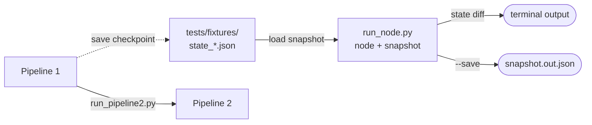
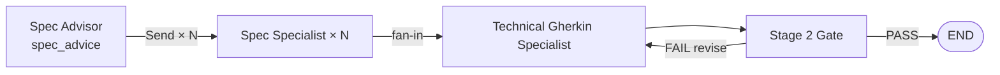
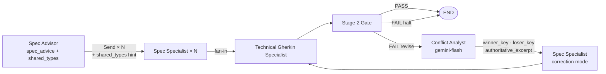

# Architecture Delta — REQ-005

**REQ:** REQ-005 — Node quality baseline, granular execution, cross-model consistency  
**Status:** Complete (T1–T6 done and validated)  
**Merge into ARCHITECTURE.md when:** REQ-005 closes (all tasks done)  
**Delete this file after merge.**

---

## Workflow changes

### Granular execution — new path alongside full pipeline (T1, applied)

Current architecture has one execution path: full pipeline end-to-end. REQ-005 adds a second path for targeted node iteration.

### Pipeline 2 — shared_types contract + conflict correction loop (T5, done)

T5 addresses cross-artefact type inconsistency in two complementary ways:

**Part 1 — Shared type names (upfront hint):** Spec Advisor emits a `shared_types[]` list of type names used by ≥2 specialists (e.g. `["ErrorResponse", "ContentResponse"]`). Each specialist receives these names injected into their `insight` field. This nudges consistent naming on the first pass but does not enforce field shapes.

**Part 2 — Hierarchical correction loop (gate feedback path):** When Stage 2 Gate fails, a new Conflict Analyst node diagnoses the conflict and a targeted correction re-runs only the offending specialist.

**Current (before T5):**

**After T5:**

**Correction loop mechanics:**

1. Stage 2 Gate fails → `gate_feedback` (plain string, unchanged)
2. **Conflict Analyst** (new node, `cloud/gemini-flash`):
   - Input: `gate_feedback` + all `spec_artefacts` + `spec_advice` (dependency map)
   - LLM identifies the ROOT conflict between upstream specs (openapi, jsonschema, rfc2119, etc.) — Gherkin failures are treated as symptoms, not root causes
   - LLM extracts minimal authoritative excerpt from the winner artefact
   - Code resolves winner/loser via `depends_on`: the artefact that others depend on wins (higher layer)
   - Output: `gate_winner_key`, `gate_loser_key`, `gate_authoritative_excerpt`
3. **Spec Specialist (correction mode)** — loser specialist only, lean prompt:
   - Receives: its previous artefact + `gate_feedback` + `gate_authoritative_excerpt`
   - Instruction: correct only the conflicting definition, return full artefact
   - Overwrites `spec_artefacts[loser_key]` via existing merge reducer
4. Technical Gherkin Specialist re-runs → Stage 2 Gate re-runs
5. Max 2 revisions (existing `MAX_REVISIONS` cap); on exhaustion: halt

**Layer hierarchy (from `depends_on`):**

| Layer | Standards | Role |
|---|---|---|
| 1 — Constraints | RFC 2119, ADR | Authoritative — never corrected |
| 2 — Architecture | C4 / Structurizr | Authoritative — never corrected |
| 3 — Interface | OpenAPI, AsyncAPI | Authoritative over Layer 4 |
| 4 — Validation | JSON Schema | Corrected to conform to Layer 3 |
| 5 — Tests | Technical Gherkin | Corrected to conform to all layers |

Edge case (same-layer conflict, no `depends_on` relationship): code falls back to LLM's winner/loser determination. Same-layer conflicts are rare (RFC 2119 and ADR address different claim types).

**State delta:**

| Key | Change |
|---|---|
| `spec_advice[].shared_types` | Existing field — list of shared type names (name-only) |
| `gate_winner_key` | New — artefact_key of the authoritative spec on gate failure |
| `gate_loser_key` | New — artefact_key of the spec to be corrected |
| `gate_authoritative_excerpt` | New — minimal conflicting definition from the winner |

**New files:**

| File | Purpose |
|---|---|
| `src/norma/graph/conflict_analyst.py` | Conflict Analyst node |
| `prompts/conflict_analyst.yaml` | Prompt seeded as `norma.conflict_analyst` |

---

## Changes applied (T1–T4)

### Execution paths — new: single-node runner (T1)

New script `scripts/run_node.py` enables running any node in isolation against a saved state snapshot. Changes to the Execution paths section:

- Add **Single node** subsection with `run_node.py` usage, `--save` flag, and model override pattern
- Add fixture table (`tests/fixtures/`) with one row per snapshot

### Test suite — new section (T2)

New section added to ARCHITECTURE.md covering:
- 57 tests total, split by file with LLM test counts
- `@pytest.mark.llm` marker — skip with `-m 'not llm'`
- Test philosophy (non-LLM assertions as primary target; gate structural assertions as ground truth)
- "Adding tests for a new node" checklist

### SPEC SPECIALIST node — statement field behaviour changed (T3)

The `statement` CRISPE field is no longer passed through verbatim from the Spec Advisor recommendation. It is now prefixed at runtime with a two-phase instruction:

- Phase 1: model generates a 4–6 line canonical example of the target spec format (`## EXAMPLE`)
- Phase 2: model uses that example as scaffold to write the full artefact (`## ARTEFACT`)

Node extracts only the `## ARTEFACT` section from the response. Falls back to full response if label absent.

Update to node entry in ARCHITECTURE.md:

> **Statement field:** prefixed at runtime with a two-phase self-anchoring instruction (see PEF.md Principle 1). The Spec Advisor's format rules are appended after the prefix — the model sees both.

### SPEC ADVISOR node — input changed + one-shot anchoring added (T4)

**Input change:** Spec Advisor no longer receives Business Gherkin. It now reads `normalised_requirement` + `selected_environment` only.

Rationale: Spec Advisor makes an architectural decision (which spec languages), not a behavioural one. Business Gherkin is the behaviour layer and adds noise without changing the spec-language decision. The normalised requirement + environment choice carries all necessary structural signal (external APIs, data contracts, deployment constraints).

State keys consumed by Spec Advisor:

| Before | After |
|---|---|
| `normalised_requirement`, `gherkin_business`, `selected_environment` | `normalised_requirement`, `selected_environment` |

**One-shot anchoring:** A concrete JSON example is now embedded in the `statement` field of `prompts/spec_advisor.yaml`. The example shows one fully-populated `SpecRecommendation` object so the model pattern-matches on the exact schema before generating its own output.

**Field length limits added:** Hard word-count limits per field prevent JSON truncation at the `max_tokens` ceiling:

| Field | Limit |
|---|---|
| `rationale` | ≤ 15 words |
| `requirement_segments` | ≤ 20 words |
| `role` | ≤ 15 words |
| `insight` | ≤ 3 bullet points × ≤ 8 words each |
| `statement` | ≤ 3 lines |

Root cause of prior silent failures: when 4–5 verbose specialists were generated, output exceeded 1500 tokens, producing truncated JSON which `_parse_advice` silently returned `[]` for.

**All 9 nodes now wired to Langfuse prompt fetch.** Four nodes were still using hardcoded prompts (`environment_advisor`, `technical_gherkin_specialist`, `stage1_gate`, `stage2_gate`). All now follow the same pattern: fetch prompt from Langfuse at runtime, cache for 300 s. Four new YAML prompt files created:

| YAML | Langfuse name | Node |
|---|---|---|
| `prompts/environment_advisor.yaml` | `norma.environment_advisor` | environment_advisor |
| `prompts/stage1_gate.yaml` | `norma.stage1_gate.rubric` | stage1_gate (LLM rubric only) |
| `prompts/stage2_gate.yaml` | `norma.stage2_gate.rubric` | stage2_gate (LLM rubric only) |
| `prompts/technical_gherkin_specialist.yaml` | `norma.technical_gherkin_specialist` | technical_gherkin_specialist |

**Run output: cost + token tracking added.** `scripts/output_utils.py` gains `fetch_run_usage()` — queries `GET /api/public/observations` on the Langfuse API after the run completes, sums `usage.input`, `usage.output`, and `calculatedTotalCost` across all observations with `usage.total > 0`. Patched into `run_summary.json` as `prompt_tokens`, `completion_tokens`, `cost_usd`. Console now shows: `Total: Xs — $X.XXXX (N in / N out)`.

**Normalised requirement now written to output folder.** `req_001.normalised.txt` is written alongside the other P1 artefacts in `output/YYYY-MM-DD/HHMMSS/`.

---

## Changes pending (T5–T6)

### T6 — No architecture change

A/B re-run across all three models after T3–T5 fixes. Results go to `findings.md`. No structural change to nodes, state, or pipelines.
