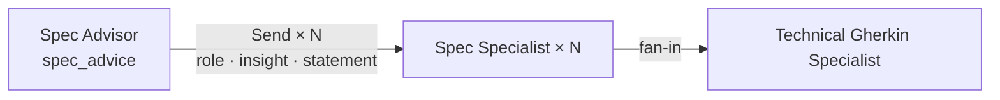
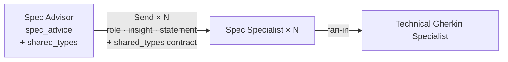

# Architecture Delta — REQ-005

**REQ:** REQ-005 — Node quality baseline, granular execution, cross-model consistency  
**Status:** In progress (T1–T3 done, T4–T6 pending)  
**Merge into ARCHITECTURE.md when:** REQ-005 closes (all tasks done)  
**Delete this file after merge.**

---

## Workflow changes

### Granular execution — new path alongside full pipeline (T1, applied)

Current architecture has one execution path: full pipeline end-to-end. REQ-005 adds a second path for targeted node iteration.

### Pipeline 2 — shared_types contract (T5, pending)

Current Pipeline 2: Spec Advisor fans out to specialists with no shared contract. Each specialist independently defines types like `ErrorResponse`, causing cross-artefact inconsistency caught only at Stage 2 Gate.

**Current:**

**After T5:**

`shared_types[]` is a pre-agreed list of type names emitted by the Spec Advisor and injected into every specialist's `insight` field before they run in parallel. Specialists reference the contract, not define it independently.

---

## Changes applied (T1–T3)

### Execution paths — new: single-node runner

New script `scripts/run_node.py` enables running any node in isolation against a saved state snapshot. Changes to the Execution paths section:

- Add **Single node** subsection with `run_node.py` usage, `--save` flag, and model override pattern
- Add fixture table (`tests/fixtures/`) with one row per snapshot

### Test suite — new section

New section added to ARCHITECTURE.md covering:
- 57 tests total, split by file with LLM test counts
- `@pytest.mark.llm` marker — skip with `-m 'not llm'`
- Test philosophy (non-LLM assertions as primary target; gate structural assertions as ground truth)
- "Adding tests for a new node" checklist

### SPEC SPECIALIST node — statement field behaviour changed

The `statement` CRISPE field is no longer passed through verbatim from the Spec Advisor recommendation. It is now prefixed at runtime with a two-phase instruction:

- Phase 1: model generates a 4–6 line canonical example of the target spec format (`## EXAMPLE`)
- Phase 2: model uses that example as scaffold to write the full artefact (`## ARTEFACT`)

Node extracts only the `## ARTEFACT` section from the response. Falls back to full response if label absent.

Update to node entry in ARCHITECTURE.md:

> **Statement field:** prefixed at runtime with a two-phase self-anchoring instruction (see PEF.md Principle 1). The Spec Advisor's format rules are appended after the prefix — the model sees both.

---

## Changes pending (T4–T6)

### T4 — SPEC ADVISOR node — statement field behaviour (same technique as T3)

Same two-phase prefix applied to Spec Advisor's `statement` field. Phase 1 generates a 2–3 item JSON example; Phase 2 produces the actual `spec_advice[]` JSON. Targets Grok JSON truncation failure.

Update to node entry: same pattern as Spec Specialist above.

### T5 — SPEC ADVISOR output — new `shared_types[]` field

`SpecRecommendation` gains a `shared_types[]` field: type names that multiple specialists will reference (e.g. `ErrorResponse`). Spec Advisor populates it; each specialist receives it in the `insight` field as a pre-agreed contract.

**State delta:**

| Key | Change |
|---|---|
| `spec_advice[].shared_types` | New field on `SpecRecommendation` — list of shared type names |

**Node delta — SPEC ADVISOR:**
> Also emits `shared_types[]` per recommendation — type names pre-agreed across specialists.

**Node delta — SPEC SPECIALIST:**
> Receives `shared_types` via `insight` field: *"The following shared types are pre-agreed: {shared_types}. Use these exact names and shapes."*

**Why this matters for the architecture:** Stage 2 Gate currently catches cross-artefact type inconsistency as a symptom. T5 fixes the root cause — no shared contract during parallel fan-out. After T5, the gate validates conformance to a contract that was established before specialists ran.

### T6 — No architecture change

A/B re-run across all three models. Results go to `findings.md`. No structural change to nodes, state, or pipelines.
